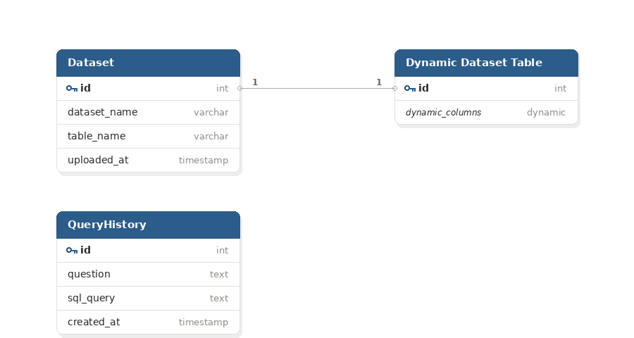
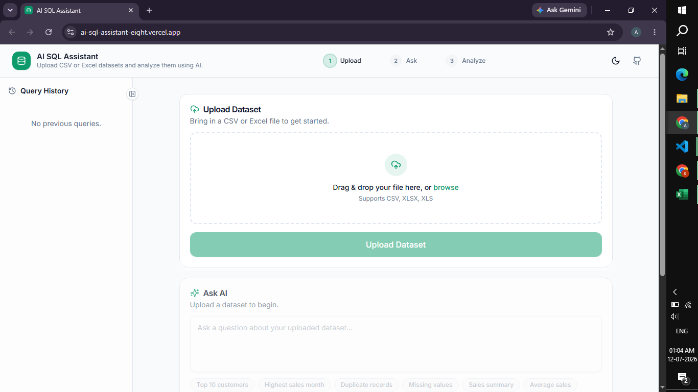
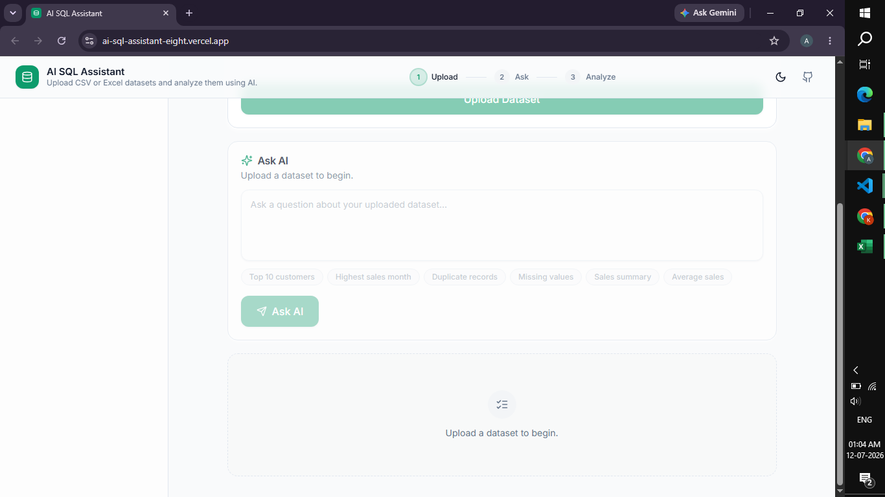
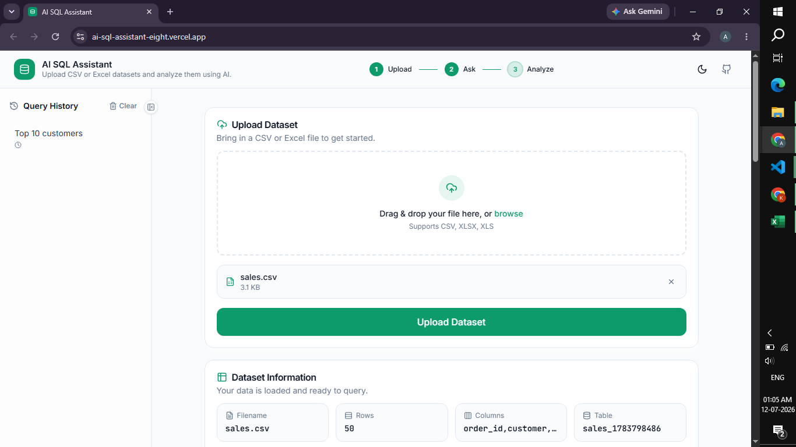
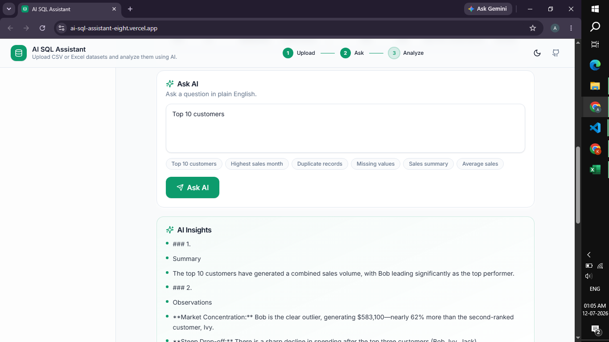
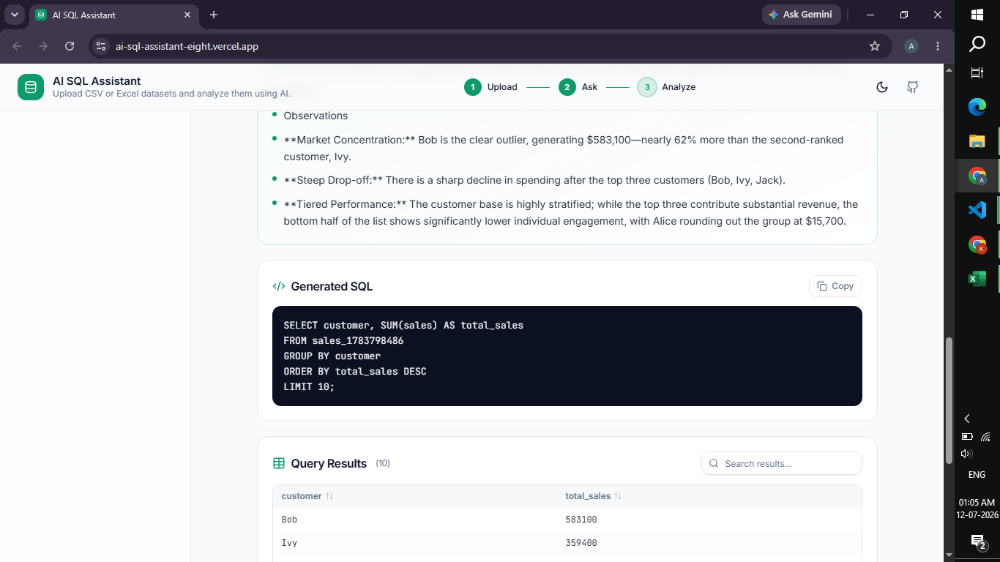
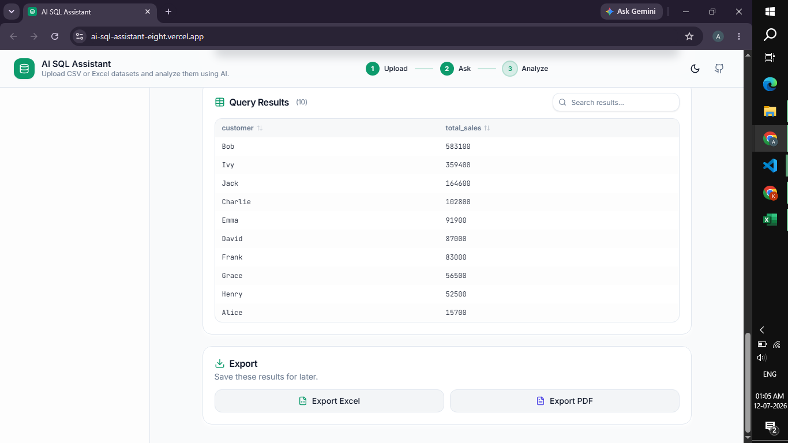
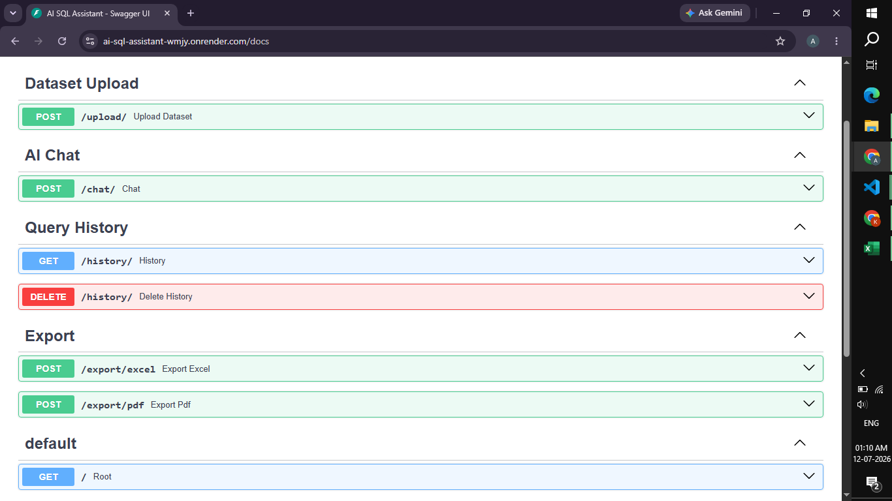

# 🤖 AI SQL Assistant

An AI-powered SQL Assistant that enables users to upload CSV/Excel datasets, ask questions in plain English, automatically generates SQL queries using Google's Gemini AI, executes them on PostgreSQL, provides AI-generated insights, and allows exporting results to Excel and PDF.

---

## 🚀 Live Demo

**Frontend:** https://ai-sql-assistant-eight.vercel.app

**Backend API:** https://ai-sql-assistant-wmjy.onrender.com

**API Documentation:** https://ai-sql-assistant-wmjy.onrender.com/docs

---

## ✨ Features

- 📂 Upload CSV and Excel datasets
- 🗄️ Dynamic PostgreSQL table creation
- 🤖 Natural Language → SQL using Gemini AI
- 📊 AI-generated insights for query results
- 📝 View generated SQL query
- 📈 Display query results in tabular format
- 📅 Automatic date column detection
- 📄 Export query results to Excel
- 📑 Export query results to PDF
- 🕒 Query history
- 🔄 History reset when a new dataset is uploaded
- ⚡ FastAPI REST APIs
- 🎨 Modern React + Tailwind UI

---

# 🏗️ System Architecture

```
                CSV / Excel
                     │
                     ▼
            Upload Dataset
                     │
                     ▼
          FastAPI Backend (Python)
                     │
     Dynamic PostgreSQL Table Creation
                     │
                     ▼
              PostgreSQL (Neon)
                     │
                     ▼
      Natural Language Question
                     │
                     ▼
          Gemini AI (SQL Generation)
                     │
                     ▼
             Execute SQL Query
                     │
                     ▼
              Query Results
                     │
        ┌────────────┴─────────────┐
        ▼                          ▼
 AI Insights                 Export Results
(Gemini AI)               Excel / PDF
```

---

# 🛠 Tech Stack

## Frontend

- React
- TypeScript
- Vite
- Tailwind CSS
- Axios
- Framer Motion

## Backend

- FastAPI
- SQLAlchemy
- Pandas
- PostgreSQL
- Google Gemini AI

## Database

- PostgreSQL (Neon)

## Deployment

- Frontend → Vercel
- Backend → Render

---

# 📂 Project Structure

```
AI-SQL-Assistant/

│
├── backend/
│   ├── app/
│   │   ├── routers/
│   │   ├── services/
│   │   ├── models/
│   │   ├── database.py
│   │   └── main.py
│   │
│   ├── requirements.txt
│   └── .env
│
├── frontend/
│   ├── src/
│   │   ├── components/
│   │   ├── services/
│   │   ├── types/
│   │   └── App.tsx
│   │
│   ├── package.json
│   └── .env
│
└── README.md
```
---

# 🗄️ Database Schema

The application uses PostgreSQL to store uploaded dataset metadata and query history. Uploaded CSV/Excel files are converted into dynamic PostgreSQL tables during runtime.

### Entity Relationship Diagram



### Database Design

- **Dataset** stores metadata for uploaded datasets, including the generated PostgreSQL table name.
- **Dynamic Dataset Table** represents the uploaded dataset stored dynamically. The schema changes depending on the uploaded CSV or Excel file.
- **QueryHistory** stores each natural language question along with the SQL query generated by the AI.
- Dynamic table creation enables the application to support datasets with different schemas without modifying the application's database structure.

---

# ⚙️ Installation

## Clone Repository

```bash
git clone https://github.com/anupamatp/AI-SQL-Assistant.git

cd AI-SQL-Assistant
```

---

# Backend Setup

```bash
cd backend

python -m venv venv

venv\Scripts\activate

pip install -r requirements.txt
```

Create a `.env` file inside the **backend** folder.

```env
DATABASE_URL=your_neon_database_url

GEMINI_API_KEY=your_gemini_api_key
```

Run the backend

```bash
uvicorn app.main:app --reload --port 8080
```

Backend runs at

```
http://localhost:8080
```

---

# Frontend Setup

```bash
cd frontend

npm install
```

Create a `.env` file inside the **frontend** folder.

```env
VITE_API_BASE_URL=http://localhost:8080
```

Run

```bash
npm run dev
```

Frontend runs at

```
http://localhost:5173
```

---

# 📊 Example Workflow

1. Upload a CSV or Excel dataset.
2. Backend dynamically creates a PostgreSQL table.
3. Ask questions in plain English.
4. Gemini AI generates SQL.
5. SQL executes on PostgreSQL.
6. Results are displayed.
7. AI generates insights.
8. Export results to Excel or PDF.

---

# 📌 Sample Questions

- Top 10 customers
- Highest sales month
- Average sales
- Missing values
- Duplicate records
- Total sales by city
- Top selling products
- Highest revenue category

---

# 📡 API Endpoints

| Method | Endpoint | Description |
|---------|----------|-------------|
| POST | `/upload/` | Upload dataset |
| POST | `/chat/` | Ask AI |
| GET | `/history/` | Query history |
| DELETE | `/history/` | Clear history |
| POST | `/export/excel` | Export Excel |
| POST | `/export/pdf` | Export PDF |

---

# 📸 Screenshots















---

# 🔮 Future Improvements

- Authentication
- User-specific datasets
- Interactive charts
- Dashboard analytics
- Multiple database support
- SQL query editing
- Saved reports

---

# 👩‍💻 Author

**Anupama T P**


GitHub: https://github.com/anupamatp